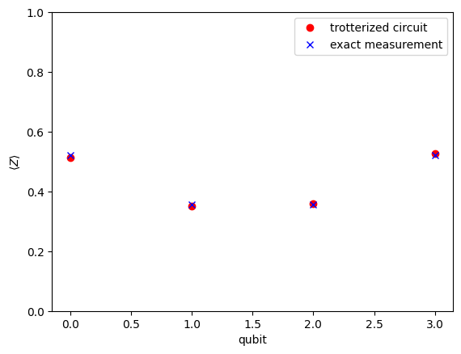

# Examples

## 9) Classical Shadow Experiment

### Overview
Classical shadow is a novel technique in quantum computing for efficiently estimating properties of quantum states. In this example, we demonstrate how to use the [`shadow`](@ref) function to construct a density matrix from the classical shadow representation of a quantum circuit. The technique involves running a series of quantum measurements and using the outcomes to reconstruct an approximation of the quantum state.

### Using the `shadow` Function
The `shadow` function takes two main arguments: a `Circuit` object and the number of experiments to run. It returns a sparse density matrix representing the classical shadow of the given circuit.

The function works by first generating a quantum state from the circuit. It then applies random measurements in one of three bases ("MX", "MY", "MZ") to each qubit. The outcomes of these measurements are used to reconstruct a classical shadow, which is an estimate of the density matrix of the quantum state.

### Example
Suppose we have a quantum circuit for which we want to estimate the density matrix. We can use the `shadow` function as follows:

```julia
# Example Circuit (e.g., a GHZ state circuit)
N = 3 # Number of qubits
ops = [Op("H", 1), Op("CNOT", 1, 2), Op("CNOT", 2, 3)]
circuit = compile(ops)

# Running the classical shadow experiment
number_of_experiments = 1000

# Estimated Density Matrix from Classical Shadow:
density_matrix = shadow(circuit, number_of_experiments)
```

This example demonstrates generating a density matrix estimate for a 3-qubit system using 1000 experiments. The `shadow` function will perform the necessary quantum state preparations, measurements, and reconstructions to provide an efficient approximation of the density matrix.

### Utilizing the Estimated Density Matrix
With the estimated density matrix from the classical shadow, you can now calculate various quantum properties. Use `density_matrix` to compute correlations, expected values, and even entanglement entropy. Refer to functions like [`expect`](@ref) for expectation values, [`correlation`](@ref) for correlations, and [`entanglement_entropy`](@ref) for quantifying entanglement.

### Conclusion
The classical shadow technique, as implemented in the [`shadow`](@ref) function, is an efficient method for estimating properties of quantum states, particularly useful in scenarios where full quantum state tomography would be too resource-intensive. While classical shadows offer an efficient alternative to full state tomography, the accuracy of the reconstruction depends on the number of experiments. A higher number of experiments typically leads to a more accurate estimation but requires more computational resources.

## 10) Entanglement Entropy and Spectrum

### Overview

Entanglement entropy is a fundamental measure in quantum information theory, indicating the degree of entanglement in quantum states. This section demonstrates how to calculate entanglement entropy and spectrum using state vectors or density matrices from quantum circuits, either built step-by-step or obtained via classical shadows.

### Entanglement Entropy from State Vectors

#### Example - Using 'apply'
Let's build a random state and calculate the bipartite entanglement.

```julia
N=4
state = zero_state(4)

ops=random_ops(N,20)

for op=ops
    state=apply(state,op)
end

# Calculate the entanglement entropy
ent_entropy, ent_spectrum = entanglement_entropy(state)
println("Entanglement Entropy:", ent_entropy)
println("Entanglement Spectrum:", ent_spectrum)
```

### Entanglement Entropy from Density Matrices

#### Example - Using 'to_rho'
For the same GHZ circuit:

```julia
circuit = compile(ops)
rho = to_rho(circuit)

# Convert circuit to density matrix
rho = to_rho(circuit)

# Calculate entanglement entropy
ent_entropy_rho, ent_spectrum_rho = entanglement_entropy(rho)
println("Entanglement Entropy from rho:", ent_entropy_rho)
println("Entanglement Spectrum from rho:", ent_spectrum_rho)
```

### Conclusion
This section demonstrates practical ways to calculate entanglement entropy and spectrum, whether from direct state vector manipulation, standard quantum circuit density matrices, or density matrices derived from classical shadows. When working with noisy or imperfect quantum systems, the calculated entanglement entropy and spectrum should be interpreted with care.

## 11) Time Evolution of Hamiltonians

### Overview
In this section, we will explore how to simulate the time evolution of a quantum system under a given Hamiltonian using the Trotterization technique. This process involves creating a quantum circuit that approximates the evolution of the system over time. We'll demonstrate this using the example of an Ising model Hamiltonian.

### Example: Ising Model Hamiltonian
Consider a one-dimensional Ising model described by the Hamiltonian:

$H = -J \sum \sigma^x_i \sigma^x_{i+1} - h \sum \sigma^z_i$

where J is the coupling constant for the interaction between adjacent qubits, h is the magnetic field strength applied in the Z-direction, and the sums run over all sites in the chain.

```julia
# Parameters for the Ising Hamiltonian
N = 4 # Number of qubits in the Ising chain
J = -1.0 # Coupling constant
h = -0.8 # Magnetic field strength
total_time = 0.6 # Total simulation time

string_hamiltonian = [J, "X,X", h, "Z"]
```

To simulate the time evolution under this Hamiltonian, we use the `hamiltonian_exp` function, which takes the number of qubits, total simulation time, and the Hamiltonian expressed as a string of operations. It returns a sequence of Trotterized quantum operations.

```julia
ops = hamiltonian_exp(N, total_time, string_hamiltonian) # Trotterized operations for evolution of Hamiltonian
c = compile(ops)
```

We can then run the quantum circuit and perform measurements:

```julia
shots = 10000
m = measure(c, shots)
```

To visualize the first few layers of the Trotterized circuit:

```julia
plotq(c.layers[1:16]) # First 16 layers
```


### Comparison with Exact Evolution
To compare the Trotterized evolution with the exact evolution, we can calculate the final state using matrix exponentiation:

```julia
H_mat = hamiltonian(N, string_hamiltonian) # Hilbert representation of the Hamiltonian
final_state = sa.sparse(exp(-im * total_time * Matrix(H_mat)) * zero_state(N))
m2 = measure(final_state) # Get exact measurement object from state vector
```

We can then plot the measurement results from both the Trotterized circuit and the exact calculation:

```julia
plotq([m, m2], ["Trotterized Circuit", "Exact Measurement"]) # Compare measurements
```


To further analyze the results, we can plot the expectation values of the Z operator for each qubit:

```julia
fig, ax = subplots(1, 1, dpi=100)

ax.plot(m.expect, "ro", label="Trotterized Circuit")
ax.plot(m2.expect, "bx", label="Exact Measurement")

legend()
xlabel("Qubit")
ylabel(L"\langle Z \rangle")
ylim(0, 1)

fig
```



### Conclusion
Trotterization is a powerful technique for simulating the time evolution of quantum systems under a given Hamiltonian. By breaking down the evolution into small time steps and applying a sequence of quantum gates, we can approximate the dynamics of the system. The `hamiltonian_exp` function in the BlueTangle package provides a convenient way to generate the Trotterized quantum circuit from a Hamiltonian expressed as a string of operations.

Comparing the Trotterized evolution with the exact calculation allows us to assess the accuracy of the approximation. The agreement between the two results depends on the size of the time step and the total simulation time. Smaller time steps generally lead to better approximations but also increase the circuit depth.

Trotterization is especially useful when the exact evolution is computationally expensive or infeasible, as is often the case for large quantum systems. It enables the study of quantum dynamics on near-term quantum devices and classical simulators.

## 12) Error Mitigation: Pauli Twirling

### Overview
In the era of NISQ quantum simulations implementing effective error mitigation strategies is essential. Pauli Twirling is a common technique that converts coherent errors into stochastic ones. However, it's important to note that while Pauli Twirling is effective in addressing certain errors, it does not completely remove existing biases in the simulation. Moreover, the process of twirling itself can be noisy, reflecting a more realistic scenario of quantum operations but also complicating the error landscape.

### Setting Up the Circuit with Rotation Errors
We start by creating a quantum circuit with a coherent noise model. This section provides a comprehensive example demonstrating the implementation of error mitigation using Pauli Twirling in a quantum simulation.

#### Setting Up the Circuit with Rotation Errors

First, we define a coherent noise model, specifically rotation errors, and apply this noise to a series of quantum operations.

```julia
rot_angle = 0.2
n1 = Noise1("rot_z", 0.1 * rot_angle * pi)
n2 = Noise2("rot_z", rot_angle * pi)
# Creating a noise model for rotation errors
nm=NoiseModel(n1,n2)

# Defining a series of quantum operations
ops = [Op("H", 1), Op("H", 2), Op("CNOT", 1, 2), Op("CNOT", 2, 1), Op("H", 1), Op("H", 2)]
```

#### Creating and Comparing Circuits

We construct three quantum circuits: an exact circuit without noise, a noisy circuit, and a circuit with Pauli Twirling applied. Each circuit is then visualized for comparison.

- **Exact Circuit**: A noise-free version of the circuit.
- **Noisy Circuit**: The same circuit with rotation errors applied.
- **Noisy Twirl Circuit**: The circuit with both rotation errors and Pauli Twirling applied.

```julia
# Creating the exact circuit
opt_exact = Options(circuit_name="exact")
circuit_exact = compile(ops,opt_exact)

# Creating the noisy circuit
opt_noisy = Options(circuit_name="noisy", noise=nm)
circuit_noisy = compile(ops,opt_noisy)

# Creating the noisy circuit with Pauli Twirling
opt_twirl = Options(circuit_name="twirl", twirl=true, noise=nm)
circuit_twirl = compile(ops, opt_twirl)

plotq(circuit_noisy)
```


#### Measurement and Analysis

Finally, let's measure each circuit and plot the results to analyze the effects of noise and error mitigation method.

```julia
# Setting the number of samples for measurement
num_samples = 1000

# Conducting measurements on the circuits
measurement_exact = measure(circuit_exact, num_samples)
measurement_noisy = measure(circuit_noisy, num_samples)
measurement_twirl = measure(circuit_twirl, num_samples)

# Plotting the measurement results
plotq([measurement_exact, measurement_noisy, measurement_twirl])
```


The resulting plots provide a visual comparison of the measurement outcomes across the three scenarios: exact, noisy, and noisy with Pauli Twirling. This helps to evaluate the effectiveness of error mitigation strategies in NISQ quantum simulations. It's important to recognize the trade-offs involved: while twirling can reduce the impact of coherent errors, it may introduce new noise sources and biases, which must be carefully considered in the analysis of the simulation results.

## 13) Error Mitigation: Zero-Noise Extrapolation

### Overview
Zero-Noise Extrapolation (ZNE) is a powerful technique for error mitigation in quantum simulations. This method strategically scales the noise in a quantum circuit upwards and then extrapolates back to a theoretical zero-noise scenario, thereby enhancing the precision of quantum computations. In this package, implementing ZNE is straightforward and can be activated with a simple option in the circuit compilation process, such as Options(zne=true). When this option is enabled, the compiler automatically introduces additional noise by inserting pairs of CNOT gates. Consequently, the sample function yields four distinct measurement objects, each corresponding to a different level of noise amplification.

### Example 1: Setting Up the Circuit with Rotation Errors
We start by creating a quantum circuit with a basic noise model.

```julia
p = 0.05
n1 = Noise1("rot_Z", 0.1 * p * pi)
n2 = Noise2("rot_Z", p * pi)
# Creating two noise models for rotation errors
nm=NoiseModel(n1,n2)

# Defining a series of quantum operations
ops = [Op("H", 1), Op("H", 2), Op("CNOT", 1, 2), Op("CNOT", 2, 1), Op("H", 1), Op("H", 2)]
```

### Creating and Analyzing Different Circuits

We construct multiple quantum circuits: an exact circuit without noise, a noisy circuit, a circuit with twirling, one with ZNE, and another combining twirling and ZNE.

```julia
# Creating the exact circuit
opt_exact = Options(circuit_name="exact", noise=nm)
circuit_exact = compile(ops,opt_exact)

# Creating the noisy circuit
opt_noisy = Options(circuit_name="noisy", noise=nm)
circuit_noisy = compile(ops,opt_noisy)
plotq(circuit_noisy)

opt_twirl = Options(circuit_name="twirl", noise=nm, twirl=true)
circuit_twirl = compile(ops, opt_twirl)
```

#### Measurement and Analysis

We measure each circuit and analyze the results to evaluate the effectiveness of Zero-Noise Extrapolation and its combination with Pauli Twirling.

```julia
shots=10000
# Conducting measurements on the circuits
m_exact = measure(circuit_exact, shots)
m_noisy = measure(circuit_noisy, shots)
m_zne = measure_ZNE(circuit_twirl, shots) # Multiple measurements for different noise levels
```

Now we plot and compare these results together with error mitigated result.

```julia
# Analysis of results using magnetization moments
using PyPlot

m_order = 1 #first magnetization moment
fig = figure()

ydata = [m.mag_moments[m_order] for m in m_zne]
xdata = collect(1:2:2length(ydata))

plot(xdata, ydata, "ro", label="Twirl and ZNE")
est, se, fit_plot = error_mitigate_data(xdata, ydata)

plot(fit_plot..., alpha=.5, color="red", "--")
plot(est, "rx", label="Error mitigated")
axhline(est + se, color="red", lw=1)
axhline(est - se, color="red", lw=1)
fill_between(-.1:1, est + se, est - se, color="red", alpha=0.1)

plot(m_exact.mag_moments[m_order], color="blue", "x", label="Exact")
plot(m_noisy.mag_moments[m_order], color="green", "s", label="Noisy")
plot(m_zne.mag_moments[m_order], color="black", "d", label="Twirl")
legend()

xlabel("Noise Level")
ylabel("Magnetization (Z)")
fig
```


This example demonstrates how Zero-Noise Extrapolation, both independently and in conjunction with Pauli Twirling, can be implemented in quantum simulations to mitigate errors. The resulting analysis provides insights into the comparative effectiveness of these techniques in improving the accuracy of quantum computations in NISQ environments.

### Example 2: Implementing Manual Noise Amplification

In this approach, we manually increase the noise in the circuit by adding pairs of CNOT gates. This is achieved using the functions [`cnot_amplifier!`](@ref) or [`op_amplifier!`](@ref), as referenced in the documentation. This manual amplification provides us with precise control over the noise levels, a critical aspect for implementing ZNE effectively. The ability to control the level of noise added makes this approach particularly advantageous for advanced users who require fine-tuned noise scaling in their quantum simulations.

```julia
# Applying manual noise amplification
m_zne = Vector{Measurement}()
for i = 0:2 #i=0 gives exact
    ops = [Op("H", 1), Op("H", 2), Op("CNOT", 1, 2), Op("CNOT", 2, 1), Op("H", 1), Op("H", 2)] # Initial operators
    cnot_amplifier!(ops, i)
    circuit=compile(ops, Options(twirl=true, noise=nm)
    push!(m_zne, measure(circuit, 1000))
end
```

We can then conduct a similar analysis for the measurement results obtained from the manually noise-amplified circuits.

## 14) Error Mitigation: Measurement Errors

### Overview
Measurement errors are a significant source of inaccuracies in quantum simulations, especially in NISQ devices. Mitigating these errors is crucial for obtaining reliable results. The technique described in the [Qiskit documentation](https://qiskit.org/documentation/stable/0.26/tutorials/noise/3_measurement_error_mitigation.html) involves creating a calibration matrix from a set of calibration circuits and then using this matrix to adjust the results of quantum measurements. The following example demonstrates how to implement this technique with BlueTangle.jl package.

### Example: Mitigating Measurement Errors
We will create a quantum circuit with measurement errors, apply a mitigation strategy, and then compare the results with and without mitigation.

```julia
# Defining the operations and the measurement error
ops = [Op("H", 1), Op("CNOT", 1, 2)]
measurement_err = Noise1("bit_flip", 0.1) #this can be any other noise model as well.

# Compiling the circuits
ce = compile(ops) # Exact circuit with no measurement error
cn = compile(ops, Options(readout_noise=m1)) # Circuit with measurement errors
cm = compile(ops, Options(readout_noise=m1, measurement_mitigate=true)) # Circuit with measurement errors and mitigation

# Performing measurements
shots = 1000
me = measure(ce, shots)
mn = measure(cn, shots)
mm = measure(cm, shots)

# Plotting the measurement results
plotq([me,mn,mm],["no error","measurement error","error mitigated measurement"])
```


This example illustrates how measurement error mitigation can be incorporated into quantum simulations to improve the accuracy of the results.


## 15) Layout and Nonlocal Swaps during Circuit Compilation

### Overview
When compiling quantum circuits for execution on physical quantum devices, it's essential to consider the connectivity constraints of the hardware. Not all qubits can directly interact with each other, and this limitation is captured by the device's qubit layout or topology. In this example, I will demonstrate how to define a custom qubit layout and how the compiler handles nonlocal operations by automatically inserting swap gates when necessary.

### Example: Custom Qubit Layout and Nonlocal Operations
First, we define a custom qubit layout using a sparse matrix. Each nonzero entry in the matrix represents a connection between the corresponding qubits.

```julia
qubit_grid = sa.SparseMatrixCSC([
    1 0 1 0;
    1 1 1 0;
    0 1 0 1;
    0 1 1 1;
])

l = Layout(qubit_grid) # Create layout object
```

We can visualize the layout geometry:

```julia
l.geometry # You can see the layout geometry later with this code
```

Next, let's define a quantum circuit with a nonlocal operation:

```julia
ops = [Op("CNOT", 3, 10), Op("H", 2), Op("X", 3)] # In this case, the CNOT gate between qubits 3 and 10 are not neighbors on the layout, so necessary swap gates will be implemented.
```

When we compile the circuit with the custom layout, the compiler detects the nonlocal operation and automatically inserts swap gates:

```julia
c = compile(ops; layout=l) # Nonlocal operation detected. Swap will be inserted.
plotq(c)
```


Now, let's consider a circuit where all operations are local with respect to the layout:

```julia
ops = [Op("CNOT", 3, 7), Op("H", 2), Op("X", 3)] # In this case, the CNOT gate between qubits 3 and 7 are neighbors on the layout, so no swap gates are needed.
```

Compiling this circuit with the same layout doesn't require any additional swap gates:

```julia
c = compile(ops; layout=l)
plotq(c) # In this case, swaps are not needed due to the layout.
```


### Nonlocal Control Operations
It's important to note that when we add a control parameter to an operation, it doesn't matter about locality. The compiler will always allow nonlocal control operations without inserting swap gates. For example:

```julia
ops = [Op("X", 3; control=1), Op("Y", 7; control=1), Op("Z", 6; control=4)]
c = compile(ops; layout=l)
plotq(c) # No swaps are inserted for nonlocal control operations
```


This behaviour is intentional and allows for the implementation of long-range interactions and global gates in quantum circuits.

### Conclusion
This example illustrates how the qubit layout affects the compilation of quantum circuits. When the circuit contains nonlocal operations with respect to the layout, the compiler automatically inserts swap gates to ensure the operations can be executed on the hardware. On the other hand, when all operations are local, no additional swap gates are needed. This automatic handling of nonlocal operations simplifies the process of adapting quantum circuits to the constraints of physical devices. The ability to define custom qubit layouts allows for the simulation of circuits on hardware with various connectivity topologies.

## 16) Hadamard Test

### Mathematical Background

The Hadamard test is a quantum algorithm that estimates the real part of the expectation value of a unitary operator $U$ with respect to a quantum state $|\psi\rangle$. Mathematically, it computes:

$\text{Re}(\langle\psi|U|\psi\rangle) = \text{Pr}(0) - \text{Pr}(1)$

where $\text{Pr}(0)$ and $\text{Pr}(1)$ are the probabilities of measuring the ancilla qubit in the $|0\rangle$ and $|1\rangle$ states, respectively.

The circuit for the Hadamard test involves an ancilla qubit and the unitary operator $U$ controlled by the ancilla qubit. The steps are as follows:

1. Prepare the ancilla qubit in the $|0\rangle$ state and the system qubit(s) in the state $|\psi\rangle$.
2. Apply a Hadamard gate to the ancilla qubit.
3. Apply the controlled-$U$ operation, with the ancilla qubit as the control and the system qubit(s) as the target(s).
4. Apply another Hadamard gate to the ancilla qubit.
5. Measure the ancilla qubit in the computational basis.

### Example

Let's consider a simple example where we want to estimate the expectation value of the Pauli $Z$ operator on a single qubit in the $|1\rangle$ state. In this case, $U = Z$ and $|\psi\rangle = |1\rangle$.

We can create the Hadamard test circuit using the following code:

```julia
# Define the operators
ops=[Op("X", 2), Op("H", 1), Op("Z", 2; control=1), Op("H", 1)]

# Plot the circuit
plotq(ops)
```


In this circuit, qubit 1 is the ancilla qubit, and qubit 2 is the system qubit. The steps are:

1. The ancilla qubit is prepared in the $|+\rangle$ state by applying a Hadamard gate to the $|0\rangle$ state.
2. The system qubit is prepared in the $|1\rangle$ state by applying an $X$ gate to the $|0\rangle$ state.
3. A Hadamard gate is applied to the ancilla qubit.
4. The controlled-$Z$ operation is applied, with the ancilla qubit controlling the $Z$ gate on the system qubit.
5. Another Hadamard gate is applied to the ancilla qubit.

We can then measure the ancilla qubit multiple times to estimate the probabilities $\text{Pr}(0)$ and $\text{Pr}(1)$:

```julia
# Measure the circuit
num_shots = 1000

state=zero_state(2)
for o=ops
    state=apply(state,o)
end

ancilla=1
pr_0,pr_1=sample(state,num_shots,ancilla) # Estimate the probabilities

# Compute the expectation value
expectation_value = pr_0 - pr_1
println("Estimated <Z> = ", expectation_value)
```

In this case, we expect the output to be close to -1, since $\langle1|Z|1\rangle = -1$.

### Conclusion

The Hadamard test is a powerful tool for estimating expectation values of unitary operators on quantum states. By using an ancilla qubit and controlled operations, we can indirectly measure the real part of the expectation value. This technique has widespread applications in quantum algorithms, such as in the Variational Quantum Eigensolver (VQE) for estimating the energy of a quantum system.

The BlueTangle package in Julia provides an intuitive way to construct and simulate Hadamard test circuits. The `control` keyword argument allows for easy creation of controlled operations, enabling the implementation of the Hadamard test and other quantum algorithms involving controlled unitaries.

## 17) Swap Test

### Mathematical Background

The Swap test is a quantum algorithm that estimates the overlap (inner product) between two quantum states $|\psi\rangle$ and $|\phi\rangle$. Mathematically, it computes:

$|\langle\psi|\phi\rangle|^2 = 2~\text{Pr}(0) - 1$

where $\text{Pr}(0)$ is the probability of measuring the ancilla qubit in the $|0\rangle$ state.

The circuit for the Swap test involves an ancilla qubit and a controlled-SWAP operation between the two quantum states. The steps are as follows:

1. Prepare the ancilla qubit in the $|0\rangle$ state and the system qubits in the states $|\psi\rangle$ and $|\phi\rangle$.
2. Apply a Hadamard gate to the ancilla qubit.
3. Apply the controlled-SWAP operation, with the ancilla qubit as the control and the system qubits as the targets.
4. Apply another Hadamard gate to the ancilla qubit.
5. Measure the ancilla qubit in the computational basis.

### Example

Let's consider an example where we want to estimate the overlap between the states $|\psi\rangle = |0\rangle$ and $|\phi\rangle = \frac{1}{\sqrt{2}}(|0\rangle + |1\rangle)$.

We can create the Swap test circuit using the following code:

```julia
# Define the operators
h = Op("H", 1)
swap = Op("SWAP", 2, 3; control=1)

ops=[
    Op("X", 2), 
    Op("H", 3), 
    h, 
    swap, 
    h
]

# Plot the circuit
plotq(ops)
```


In this circuit:
- Qubit 1: Ancilla qubit.
- Qubit 2: System qubit prepared in the state $|\psi\rangle$.
- Qubit 3: System qubit prepared in the state $|\phi\rangle$.

The steps are:
1. The system qubit 2 is prepared in the state $|\psi\rangle$ by applying an $X$ gate.
2. The system qubit 3 is prepared in the state $|\phi\rangle$ by applying an $H$ gate.
3. A Hadamard gate is applied to the ancilla qubit.
4. The controlled-SWAP operation is applied, with the ancilla qubit controlling the SWAP operation between qubits 2 and 3.
5. Another Hadamard gate is applied to the ancilla qubit.
We can then measure the ancilla qubit multiple times to estimate the probability $\text{Pr}(0)$:

```julia
state=zero_state(3)
for o=ops
    state=apply(state,o)
end

# Estimate the probability
num_shots = 1000
ancilla=1
pr_0,pr_1 = sample(state,num_shots,ancilla)

# Compute the overlap
overlap = 1 - 2 * pr_1
# overlap = 2 * pr_0 - 1

println("Estimated |<ψ|ϕ>|^2 = ", overlap)
```

In this case, we expect the output to be close to 0.5, since $|\langle0|\frac{1}{\sqrt{2}}(|0\rangle + |1\rangle)|^2 = 0.5$.

### Conclusion

The Swap test is a quantum algorithm that estimates the overlap between two quantum states. By using an ancilla qubit and a controlled-SWAP operation, we can indirectly measure the magnitude squared of the inner product between the states. This technique has applications in quantum machine learning, quantum state comparison, and quantum state tomography.

The BlueTangle package in Julia provides a straightforward way to construct and simulate Swap test circuits. The `control` keyword argument enables the easy creation of controlled operations, allowing for the implementation of the Swap test and other quantum algorithms involving controlled gates.


## 18) Variational Quantum Eigensolver

### Overview
The Variational Quantum Eigensolver (VQE) is a hybrid quantum-classical algorithm used to find the lowest eigenvalue of a given Hamiltonian. It's particularly useful for quantum chemistry and optimization problems. In this example, we'll demonstrate how to use VQE to find the ground state energy of a quantum system described by a specific Hamiltonian. We'll also show how to calculate the entanglement entropy of the resulting state.

### Example: VQE for a 1D Transverse Field Ising Model
Consider a one-dimensional transverse field Ising model described by the Hamiltonian:

$H = -J \sum \sigma^z_i \sigma^z_{i+1} - h \sum \sigma^x_i$

where $J$ is the interaction strength, $h$ is the transverse field strength, and the sums run over all sites in the chain.

```julia
N = 5  # Number of qubits in the Ising chain
J = -1.0          # Coupling constant
h = -.9         # Magnetic field strength

string_hamiltonian=[J,"Z,Z",h,"X"]

H = hamiltonian(N, string_hamiltonian); #Hamiltonian

# Calculating the exact ground state energy for comparison
me = la.eigen(Matrix(H)).values[1]
```

Next, we set up the VQE algorithm:

```julia
gate_list = ["RY", "CNOT"] # Ansatz consisting of RY and CNOT gates

ansatz = AnsatzOptions(
    N = N,
    deep_circuit = true, # Use a deep circuit ansatz
    ops = gate_list,
    model = "lbfgs" # Using the momentum optimiser
)

plotq(ansatz)
```


VQE algorithm can be run as following

```julia
en, pars = VQE(H, ansatz) # Running the VQE algorithm
```

We can plot the convergence of the VQE algorithm:

```julia
fig = figure()

plot(1:length(en), en, "rp", label="$(ansatz.model)=$(ro3(en[end]))")
axhline(me, label="exact=$(ro3(me))", c="blue")
legend()
fig
```


### Using Custom Operations
You can also include your own set of operations when creating the AnsatzOptions object. For example:

```julia
ops = [[Op("RY", _RY, i) for i=1:N]..., Op("CNOT", 3, 4), Op("CNOT", 3, 4; control=1),
Op("RY", _RY, 4; control=1), Op("RY", _RY, 3; control=5), Op("FSIM", _FSIM, 2, 3),
Op("FSIM", _FSIM, 4, 5)]

ansatz = AnsatzOptions(
    N = N,
    pars_initial = ones(100), # Initial parameters
    ops = ops,
    model = "lbfgs" # Using the L-BFGS optimiser
)

plotq(ansatz.ops)
```


The procedure for using custom operations is the same as before. Simply create an AnsatzOptions object with your custom operations.
Note that when creating your own set of operators, you need to use
`Op("name", function_that_gives_matrix, qubit)` for single-qubit operations
`Op("name", function_that_gives_matrix, qubit1, qubit2)` for two-qubit operations or
`Op("name", function_that_gives_matrix, qubit;control=control_qubit)` for nonlocal controlled operations.

After creating the `AnsatzOptions` object, you can access its details. For example:

- `ansatz.ops` gives the operators used in the ansatz.

- `plotq(ansatz)` plots the ansatz circuit using 

- `ansatz.dim` gives the dimension of the ansatz, i.e., the number of fitting parameters.

- `ansatz.method` gives the method used in the optimisation. Other examples are `adam`, `descent`, `radam`, `momentum`, `nesterov`, `lbfgs`.

### Calculating Entanglement Entropy
After obtaining the ground state from the VQE algorithm, we can calculate its entanglement entropy.

```julia
# Obtaining the ground state
ground_state = variational_apply(pars, ansatz)

# Calculating the entanglement entropy
ent_entropy, ent_spectrum = entanglement_entropy(ground_state)

println("Entanglement Entropy: ", ent_entropy)
println("Entanglement Spectrum: ", ent_spectrum)
```

The entanglement_entropy function calculates the entanglement entropy and spectrum of the given state. The entanglement entropy quantifies the amount of entanglement between the two halves of the system, while the entanglement spectrum provides more detailed information about the entanglement structure.

### Conclusion
This example demonstrates how to use the VQE algorithm to find the ground state of a quantum system and how to calculate the entanglement entropy of the resulting state. VQE is a powerful tool for studying quantum systems, especially when the exact diagonalization of the Hamiltonian is computationally infeasible. The entanglement entropy and spectrum provide valuable insights into the quantum correlations present in the system. The flexibility to use custom operations in the ansatz allows for the exploration of a wide range of quantum circuits.

## 19) Measurement-induced entanglement transition using MPS

### Overview
In this section, we'll explore how measurements can induce entanglement in quantum systems using the Matrix Product State (MPS) representation. MPS is a powerful tool for efficiently simulating quantum systems, especially those with a large number of qubits. We'll create random quantum circuits with measurements and analyze how the entanglement entropy changes with the measurement probability.

### Example: Random Quantum Circuits with Measurements
First, we initialize the Hilbert space and MPS representation for a given number of qubits:

```julia
using BlueTangle
include(pathof(BlueTangle) * "../../extra/pyplot.jl")
```

Next, we create a random quantum circuit with a specified depth and measurement probability:

```julia
N, M = init(6) # This creates qubit number N for Hilbert space and M for MPS sites.

depth = 3 #without measurements
ops = random_ops(N, depth; measure_prob=0.1, measure_basis=["MZ"]) # Measurement probability is 0.1 and the basis is Z.
plotq(ops)
```


We can apply these operations to both the Hilbert space state and the MPS state:

```julia
state = zero_state(N) # Create zero state (Hilbert)
psi = zero_state(M) # Create zero state (MPS)

for o in ops # Apply operators
    psi = apply(psi, o)
    state = apply(state, o)
end

state ≈ BlueTangle.to_state(psi) # Convert MPS to state and check if they are equal
```

### Measurement Induced Entanglement Transition
Now, let's create a circuit and check how measurement induced entanglement transition exists:

```julia
dict_S = Dict() # We save results here
depth = 30
maxdim = 40 # This sets the maximum bond dimension
mp_list = 0.1:0.1:1.0 # This is the measurement probability range

for qubits in [30, 40]
    N, M = init(qubits) # This creates N for Hilbert space and M for MPS sites. Note the large number of qubits, which is feasible thanks to the MPS representation.
    
    for mp in mp_list # Run over different measurement probabilities
        S_list = []
        
        for experiment in 1:50 # Number of realisations
            ops = random_ops(N, depth; measure_prob=mp, measure_basis=["MZ"])
            psi = zero_state(M)
            
            for o in ops
                psi = apply(o, psi; maxdim=maxdim)
            end
            
            push!(S_list, entanglement_entropy(psi)) # Calculate entanglement entropy
        end
        
        dict_S[N, mp] = S_list
    end
end
```

Finally, we can plot the average entanglement entropy as a function of the measurement probability for different system sizes:

```julia
fig = figure()

N=30;plot(mp_list,[mean(dict_S[N,mp]) for mp=mp_list], label="N=$(N)",marker="s",ls="none")
N=40;plot(mp_list,[mean(dict_S[N,mp]) for mp=mp_list],label="N=$(N)",marker="p",ls="none")

xlabel("measurement probability")
ylabel("entanglement entropy")
legend()

fig
```


### Conclusion
This example demonstrates how measurement induced entanglement transition can be studied using the MPS representation. By creating random quantum circuits with measurements and varying the measurement probability, we can analyze how the entanglement entropy changes. The MPS representation allows us to efficiently simulate quantum systems with a large number of qubits, which would be computationally intractable using the full Hilbert space representation. This technique can be used to study various quantum phenomena and to understand the role of measurements in quantum systems.