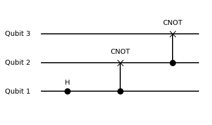
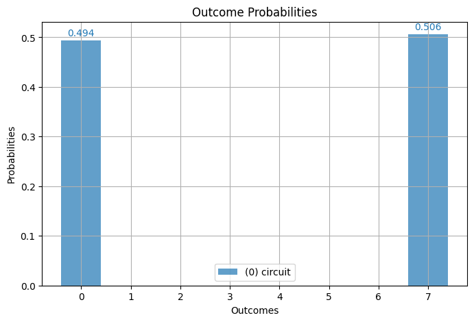
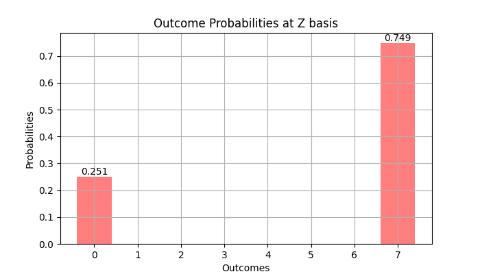
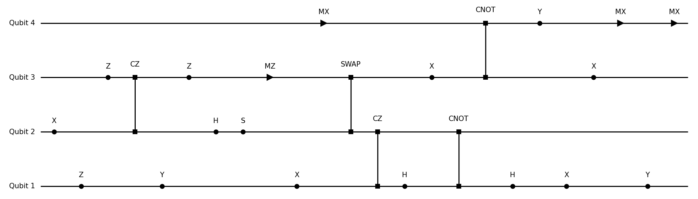

# Examples

## 1) GHZ Circuit

### Overview
This example demonstrates the use of the package for creating a Greenberger–Horne–Zeilinger (GHZ) state circuit.

### Example
#### Step 1: Collect Quantum Operations
Define quantum operations to prepare the GHZ state.

```julia
using BlueTangle

# Quantum gates
hadamard = Op("H", 1) # Hadamard gate on the first qubit
cnot1 = Op("CNOT", 1, 2) # CNOT gate between first and second qubits
cnot2 = Op("CNOT", 2, 3) # CNOT gate between second and third qubits

ops = [hadamard, cnot1, cnot2] # Collect operators
```

#### Step 2: Create Quantum Circuit
Next, we [`compile`](@ref) these operations into a quantum circuit and check its properties.

```julia
circuit = compile(ops) # Create a quantum circuit
println("Circuit stats:", circuit.stats)
```

## 2) Measurement and Correlations

### Overview

This section explores two methods for obtaining measurement data and correlations from a quantum circuit, showcasing two distinct approaches:

1. **Sampling Measurement**: This approach involves approximating values by taking multiple samples from the quantum circuit.
2. **Exact Calculation using Density Matrix**: This method uses the density matrix of the circuit for precise calculations.

### Measurement - Sampling Approach
Perform measurements through sampling and analyse the results. For more details on this function, see [`measure`](@ref).

```julia
shots = 1000
measurement1 = measure(circuit, shots) # Sample the circuit

println("Attributes of the measurement object",fields(measurement1))

# Output measurement details
println("Expectation values:", measurement1.expect)
println("Total magnetization moments:", measurement1.mag_moments)

# Calculate correlations: ⟨Z₁Z₂⟩
correlations1 = correlation(measurement1, [1, 2])
println("Correlations:", correlations1)
```

### Measurement - Exact Approach using Density Matrix
Alternatively, we can use the density matrix for exact calculations. Similar one can use state vectors as well, see [`to_state`](@ref).

```julia
density_matrix = to_rho(circuit)

# Calculate exact expectation values and correlations
expect2 = expect(density_matrix, "Z")
correlations2 = correlation(density_matrix, "Z,Z", [1, 2]) # Calculate correlations: ⟨Z₁Z₂⟩

println("Exact expectation values:", expect2)
println("Exact correlations:", correlations2)
```

**Calculations in Different Bases**

With the exact density matrix, we can explore correlations in different bases, unlike the sampling measurement.

```julia
expect3 = expect(density_matrix, "Y")
correlations3 = correlation(density_matrix, "Z,X", [1, 3])

println("Expectation values <Y>:", expect3)
println("Correlations <Z₁X₃>:", correlations3)
```

This example highlights the flexibility and power of the package in quantum circuit analysis and simulation.

## 3) Plot Circuits and Measurements

### Overview

The `plotq` function is designed to create visual representations of quantum circuits, while the `plotq` function displays the results of quantum measurements. Both of these functions are dependent on the `PyPlot` package.

### Example

#### Step 1: Define and Compile a Quantum Circuit
Create a simple quantum circuit for demonstration.

```julia
using BlueTangle
include(pathof(BlueTangle) * "../../extra/pyplot.jl")
```

```julia
# Quantum gates for a basic circuit
hadamard = Op("H", 1)
cnot12 = Op("CNOT", 1, 2)
cnot23 = Op("CNOT", 2, 3)

# Compile the circuit
circuit = compile([hadamard, cnot12, cnot23])
```

#### Step 2: Visualize the Circuit
Use `plotq` to visualize the circuit structure.

```julia
plotq(circuit)
```



#### Step 3: Perform Measurements and Analyze Results
Conduct measurements on the circuit and examine the outcomes.

```julia
measurement = measure(circuit, 1000) # Sample the circuit 1000 times
```

#### Step 4: Plot Measurement Results
Visualize the measurement data using `plotq`.

```julia
plotq(measurement)
```



### Troubleshooting Plotting Issues

If you encounter problems with plotting, please follow these steps:

**Install PyPlot in Julia**: Add the `PyPlot` package to your Julia environment. This package provides an interface to the `matplotlib` library in Python. You can install it using the Julia package manager:

```julia
import Pkg
Pkg.add("PyPlot")
```

**Install Python Matplotlib**: Ensure that `matplotlib` is installed in your Python environment. This is a prerequisite for `PyPlot` as it relies on Python's `matplotlib` for plotting. You can install `matplotlib` using `pip`:

```bash
pip3 install matplotlib
```

For detailed documentation and additional information, refer to the [`PyPlot` GitHub page](https://github.com/JuliaPy/PyPlot.jl).

## 4) Noise Models and Circuits

### Overview
This example shows how to create noisy quantum circuits using predefined quantum noise models. The package offers precise control over each quantum operation, allowing for different noise models for individual operations or overall models for single and two-qubit operations.

### Predefined Noise Models
- `amplitude_damping`: Simulates energy loss in a quantum system. Parameter `γ` (given by `p`) indicates the excitation loss probability.
- `phase_damping`: Loss of quantum information without energy loss. Parameter `γ` quantifies the likelihood of a phase shift.
- `phase_flip`: Introduces phase errors (Z error) with probability `p`.
- `bit_flip`: Causes state flips (X error) with probability `p`.
- `bit_phase_flip`: Combines bit and phase flips, applying Y error with probability `p`.
- `depolarizing`: General error model where any Pauli operation (X, Y, Z) can occur with equal probability. Parameter `p` is the overall error probability.
- `rot_X`, `rot_Y`, `rot_Z`, `rot_P`: Coherent errors (incorrect rotations) around respective axes. Parameter `p` specifies rotation error magnitude.

### Implementing Noise in Circuits

The code below demonstrates how to create a noise model for single qubit gates. The second parameter defines either the amplitude or the probability of the noise model, depending on the selected model. For example:

```julia
noise_model1 = Noise1("bit_flip", 0.001)
```

In this instance, [`Noise1`](@ref) constructs a noise model for single qubit operations, specifically a bit flip error, with a probability of 0.001 (or 0.1%).

Similarly, a noise model for two-qubit operations can be created:

```julia
noise_model2 = Noise2("depolarizing", 0.01)
```

Here, [`Noise2`](@ref) is applied to create a depolarizing channel noise model for two-qubit gates, with an error probability of 0.01 (or 1%).

We can now create the `NoiseModel` as following

```julia
nm=NoiseModel(n1,n2)

#Alternatively following constructions give the same result

nm=NoiseModel("bit_flip", 0.001,"depolarizing", 0.01)
nm=NoiseModel(["bit_flip", 0.001],["depolarizing", 0.01])
```

Next, we will illustrate incorporating these noise models into a quantum circuit.

```julia
ops = [Op("H", 1), Op("CNOT", 1, 2), Op("CNOT", 2, 3)]
noisy_circuit = compile(ops, Options(noise=nm))
```

## 5) Custom Noise Models and Gates

### Overview and Examples

- Predefined constant gates, such as `gate[:X]`, `gate[:CNOT]` or `gate.T`, can be easily accessed. For more details, see [`gate`](@ref).

- Phase (`P`) and rotation gates (`RX`, `RY`, `RZ`) can be accessed through `gates1("RX(.3)")`, or the controlled phase gate via `gates("CP(.3)")`. Refer to `gates` and `gates` for more information. Additionally, all single qubit rotations can be created using `U` gates with Euler angles, as detailed in `_P`, `_U2`, and `_U3`.

- For custom defined gates, you can construct your own unitary matrix and create an `Op` object using the following constructor: `Op("name_of_my_gate", matrix, qubit)`.

- To create a custom noise model, define your own Kraus operators for a single qubit model using `QuantumChannel(1, "name_of_model", 0, vector_of_kraus_matrices)` or for a two-qubit model with `QuantumChannel(2, "name_of_model", 0, vector_of_kraus_matrices)`. It's important to first check if your Kraus operators satisfy the trace-preserving condition using the [`iskraus`](@ref) function. Alternatively, you can use the simpler constructor `custom_noise(q, name_of_model, vector_of_kraus_matrices)`, where `q` is either 1 or 2 for single and two qubit gates, respectively.

## 6) Conditional Mid-Measurements

### Overview

This section introduces the concept and implementation of conditional mid-measurements in quantum circuits. Mid-measurements are powerful tools that allow for conditional execution of quantum operations based on the results of measurements made during the circuit's execution. The application of the Born rule in these measurements adds a probabilistic dimension to the circuit's behaviour.

### Conditional Mid-Measurements with `ifOp`

The [`ifOp`](@ref) function enables conditional mid-measurements. For instance, consider a mid-measurement in the X basis for the first qubit, followed by conditional operations:

```julia
mid_measurement = ifOp("MX", 1, "Z", "H")
ops = [Op("X", 1), mid_measurement, Op("CNOT", 1, 2), Op("CNOT", 2, 3)]
```

Let's break down the example to understand it better:

**Function Overview: `ifOp`**
   - The `ifOp` function is used to apply different quantum operations conditionally, depending on the outcome of a mid-circuit measurement.

**Setting Up a Conditional Operation:**
   - In the example, `mid_measurement = ifOp("MX", 1, "Z", "H")` defines a conditional operation.
   - `"MX"` specifies the measurement basis (here, the X basis).
   - The number `1` indicates that the measurement is performed on the first qubit.
   - `Z` (Z gate) and `H` (Hadamard gate) are the conditional operations.
   - The function is set up so that if the measurement result of the first qubit in the X basis is `0`, the Z gate (`Z`) is applied. If the result is `1`, the Hadamard gate (`H`) is applied.

**Sequence of Operations:**
   - The operations sequence is given by `ops = [Op("X", 1), mid_measurement, Op("CNOT", 1, 2), Op("CNOT", 2, 3)]`.
   - `Op("X", 1)` applies an X gate to the first qubit.
   - `mid_measurement` is then executed, which is the conditional operation defined above.
   - Following the conditional operation, two CNOT gates are applied: `Op("CNOT", 1, 2)` entangles the first and second qubits, and `Op("CNOT", 2, 3)` entangles the second and third qubits.

**Outcome:**
   - The outcome of `mid_measurement` directly influences the state of the circuit after the measurement.
   - Depending on the measurement result, the circuit will have either undergone a Hadamard transformation (if the result was `0`) or a Z transformation (if the result was `1`) on the first qubit before proceeding to the subsequent CNOT gates.

### Workout Example

1. **Starting State**: The initial state is |000⟩.
2. **Application of X Gate**: Applying the X gate to the first qubit changes the state to |100⟩.
3. **Conditional Mid-Measurement**: When the first qubit is measured in the X basis, the outcome is determined by the Born rule from a superposition state of |000⟩ and -|100⟩. Based on the measurement:
   - If the result is 0, apply a Z gate. The state becomes superposition state of |000⟩ and -|100⟩.
   - If the result is 1, apply a H gate. The state becomes -|100⟩.
4. **Subsequent CNOT Operations**: Applying the first CNOT gate entangles the first and second qubits, and the second CNOT gate entangles the second and third qubits. This results in either the state |111⟩ or (|000⟩ - |111⟩)/√2, each with a 50% probability due to the superposition created by the mid-measurement.

Let's test this using two different methods.

### Method 1 - Simulation with a Circuit

To test the operations, we first compile the circuit and then sample it to obtain a measurement object. The [`compile`](@ref) function is used to assemble the circuit, and [`measure`](@ref) is employed to simulate the circuit's execution and generate a [`Measurement`](@ref) object.

```julia
circuit = compile(ops)
measurement = measure(circuit,1000)
```

After obtaining the measurement object, we can visualise the results:

```julia
plotq(measurement)
```



The measurement results show that half of the time, the state is on `7=|111⟩`, and the other half, it is on the GHZ state (`7=|111⟩` and `0=|000⟩`).

### Method 2 - Manual Simulation with a Quantum Simulator

Alternatively, we can manually simulate the same process using a quantum simulator. This approach provides a more hands-on understanding of how each operation affects the state of the quantum system:

```julia
state = zero_state(3) # Initial state for N=3
state=apply(state, Op("X", 1)) # Apply X on qubit 1
state=apply(state, ifOp("MX", 1, "Z", "H")) # Measure qubit 1 in X basis. Apply Z if result is 0, H if 1.
state=apply(state, Op("CNOT", 1, 2)) # Apply CNOT on qubit 1 and 2
state=apply(state, Op("CNOT", 2, 3)) # Apply CNOT on qubit 2 and 3
state # Final result: either GHZ state or |111> state.
```

This manual simulation helps illustrate the probabilistic nature of quantum circuits involving mid-measurements and demonstrates the creation of complex quantum states, such as the GHZ state.

## 7) Reset Operation on a Qubit

### Overview

In this example, we demonstrate how to implement a reset operation on a qubit. This operation involves measuring a qubit and, depending on the outcome, applying a corrective operation. Specifically, if the qubit is measured and found to be in the |1⟩ state, an X gate is applied to bring it back to the |0⟩ state. We'll illustrate this concept by creating a Bell state and then resetting the first qubit.

### Example 1: Reset via measurement

First, we start by preparing a Bell state. A Bell state is a maximally entangled quantum state of two qubits. It represents a perfect example of quantum entanglement and is foundational in quantum computing and quantum information theory.

```julia
# Number of qubits
N = 2

# Initialising the state vector
state = zero_state(N)

# Applying Hadamard gate to the first qubit
state=apply(state, Op("H", 1))

# Applying CNOT gate with the first qubit as control and the second as target
state=apply(state, Op("CX", 1, 2))

# Show the state of the qubits
display(state)
```

At this point, the system is in a Bell state, which is an equal superposition of |00⟩ and |11⟩ states. You can see this with the following code

```julia
fock_basis_create(N)
```

Now, we'll implement the reset operation on the first qubit. This operation involves measuring the first qubit. If the measurement result is |1⟩, we apply the X gate to flip it back to |0⟩. 

```julia
# Reset operation on the first qubit
op = Op("RES", 1)
apply(state, op)
```

### Understanding the Outcome

After the reset operation, the state of the qubits can be either |00⟩ or |01⟩. The outcome depends on the state of the first qubit at the time of measurement. If the first qubit was in the |0⟩ state (which happens with a 50% probability due to the Bell state's nature), the reset operation does nothing. However, if the first qubit was in the |1⟩ state (again, a 50% chance), the X gate flips it to |0⟩. 

Since the second qubit is entangled with the first, its state is correlated. Therefore, measuring the first qubit and applying the reset operation affects the overall state of the two-qubit system. 

## 8) Random Quantum Circuits

### Overview
In this section, we explore the generation of random quantum circuits, a powerful tool for various quantum computing simulations. The circuits can consist of Clifford gates, a mix of Clifford and non-Clifford gates, and optional mid-circuit measurements in specified bases.

### Generating Random Clifford Operations
Define the number of qubits (N) and the length of the quantum circuit (len), then generate a random sequence of Clifford operations:

```julia
N = 3 # Number of qubits
len = 5 # Length of the quantum circuit
random_operations = random_clifford(N, len)
```

### Generating Mixed Random Operations
For a more diverse circuit, generate a random sequence including both Clifford and non-Clifford operations. Note that following code will generate depth=len circuit.

```julia
random_operations = random_ops(N, len)
```

### Including Mid-Circuit Measurements

The `random_clifford` function can also incorporate mid-circuit measurements. This is controlled by the `measure_prob` parameter, which dictates the probability of a measurement occurring after each gate, and the `measure_basis` parameter, specifying the measurement bases (e.g., "MX", "MY", "MZ").

For instance, to create a random sequence of Clifford gates with a 20% chance of measurement in either the "MX" or "MZ" basis after each gate in a 5-qubit system:

```julia
ops = random_clifford(5, 20; measure_prob=0.2, measure_basis=["MX","MZ"])
random_circuit = compile(ops)
```

This function will randomly select operations from a set of Clifford gates or measurements, applying them to either single or adjacent qubits. 

### Visualizing the Random Circuit

After generating the random operations, you can visualize the circuit to better understand its structure:
```julia
plotq(random_circuit)
```



This approach to creating and visualizing random quantum circuits showcases the versatility and capabilities of the package in simulating various quantum computing scenarios.