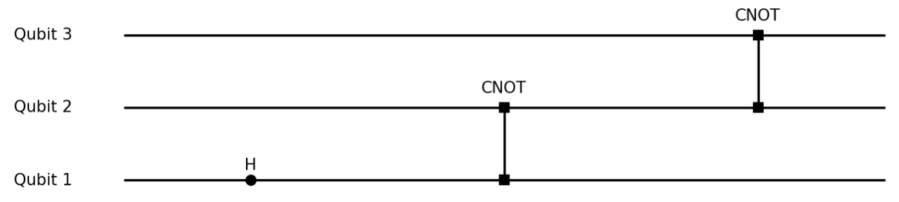
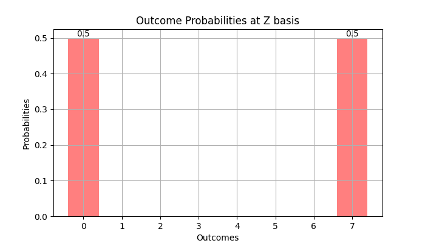
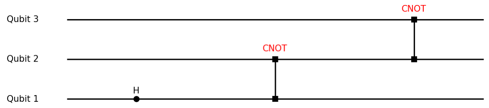
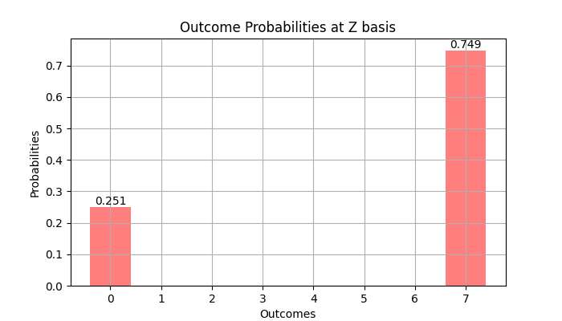
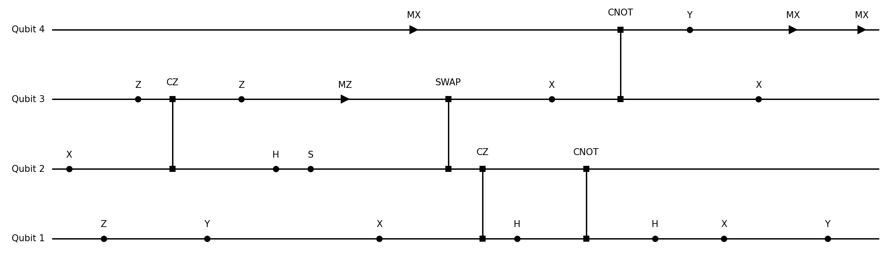
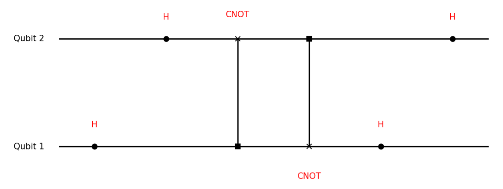
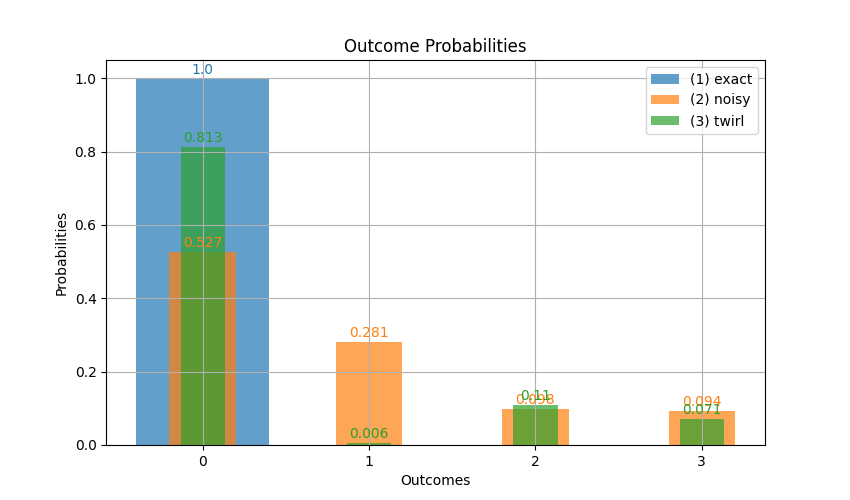
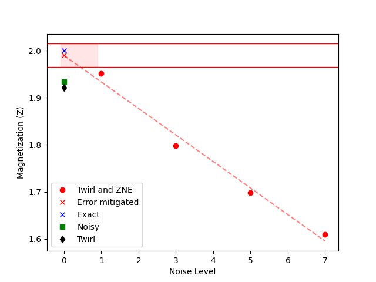

# Examples

## 1) GHZ Circuit

### Overview
This example demonstrates the use of the package for creating a Greenberger–Horne–Zeilinger (GHZ) state circuit.

### Example
#### Step 1: Collect Quantum Operations
Define quantum operations to prepare the GHZ state.

```julia
# Quantum gates
hadamard = Op("H", 1) # Hadamard gate on the first qubit
cnot1 = Op("CNOT", 1, 2) # CNOT gate between first and second qubits
cnot2 = Op("CNOT", 2, 3) # CNOT gate between second and third qubits

ops = [hadamard, cnot1, cnot2] # Collect operators
```

#### Step 2: Create Quantum Circuit
Next, we [`compile`](@ref) these operations into a quantum circuit and check its properties.

```julia
circuit = compile(ops) # Create a quantum circuit
println("Circuit stats:", circuit.stats)
```

## 2) Measurement and Correlations

### Overview

This section explores two methods for obtaining measurement data and correlations from a quantum circuit, showcasing two distinct approaches:

1. **Sampling Measurement**: This approach involves approximating values by taking multiple samples from the quantum circuit.
2. **Exact Calculation using Density Matrix**: This method uses the density matrix of the circuit for precise calculations.

### Measurement - Sampling Approach
Perform measurements through sampling and analyse the results. For more details on this function, see [`sample`](@ref).

```julia
shots = 1000
measurement1 = sample(circuit, shots) # Sample the circuit

println("Attributes of the measurement object",fields(measurement1))

# Output measurement details
println("Expectation values:", measurement1.expect)
println("Total magnetization moments:", measurement1.mag_moments)

# Calculate correlations: ⟨Z₁Z₂⟩
correlations1 = get_corr_from_measurement(measurement1, [1, 2])
println("Correlations:", correlations1)
```

### Measurement - Exact Approach using Density Matrix
Alternatively, we can use the density matrix for exact calculations. Similar one can use state vectors as well, see [`circuit_to_state`](@ref).

```julia
density_matrix = circuit_to_rho(circuit)

# Calculate exact expectation values and correlations
expect2 = get_expect(density_matrix, "Z")
correlations2 = get_corr(density_matrix, "Z,Z", [1, 2]) # Calculate correlations: ⟨Z₁Z₂⟩

println("Exact expectation values:", expect2)
println("Exact correlations:", correlations2)
```

**Calculations in Different Bases**

With the exact density matrix, we can explore correlations in different bases, unlike the sampling measurement.

```julia
expect3 = get_expect(density_matrix, "Y")
correlations3 = get_corr(density_matrix, "Z,X", [1, 3])

println("Expectation values <Y>:", expect3)
println("Correlations <Z₁X₃>:", correlations3)
```

This example highlights the flexibility and power of the package in quantum circuit analysis and simulation.

## 3) Plot Circuits and Measurements

### Overview

The [`plot_circuit`](@ref) function is designed to create visual representations of quantum circuits, while the [`plot_measurement`](@ref) function displays the results of quantum measurements. Both of these functions are dependent on the `PyPlot` package.

### Example

#### Step 1: Define and Compile a Quantum Circuit
Create a simple quantum circuit for demonstration.

```julia
# Quantum gates for a basic circuit
hadamard = Op("H", 1)
cnot12 = Op("CNOT", 1, 2)
cnot23 = Op("CNOT", 2, 3)

# Compile the circuit
circuit = compile([hadamard, cnot12, cnot23])
```

#### Step 2: Visualize the Circuit
Use `plot_circuit` to visualize the circuit structure.

```julia
plot_circuit(circuit)
```



#### Step 3: Perform Measurements and Analyze Results
Conduct measurements on the circuit and examine the outcomes.

```julia
measurement = sample(circuit, 1000) # Sample the circuit 1000 times
```

#### Step 4: Plot Measurement Results
Visualize the measurement data using `plot_measurement`.

```julia
plot_measurement(measurement)
```



### Troubleshooting Plotting Issues

If you encounter problems with plotting, please follow these steps:

**Install PyPlot in Julia**: Add the `PyPlot` package to your Julia environment. This package provides an interface to the `matplotlib` library in Python. You can install it using the Julia package manager:

```julia
import Pkg
Pkg.add("PyPlot")
```

**Install Python Matplotlib**: Ensure that `matplotlib` is installed in your Python environment. This is a prerequisite for `PyPlot` as it relies on Python's `matplotlib` for plotting. You can install `matplotlib` using `pip`:

```bash
pip3 install matplotlib
```

For detailed documentation and additional information, refer to the [`PyPlot` GitHub page](https://github.com/JuliaPy/PyPlot.jl).

## 4) Noise Models and Circuits

### Overview
This example shows how to create noisy quantum circuits using predefined quantum noise models. The package offers precise control over each quantum operation, allowing for different noise models for individual operations or overall models for single and two-qubit operations.

### Predefined Noise Models
- `amplitude_damping`: Simulates energy loss in a quantum system. Parameter `γ` (given by `p`) indicates the excitation loss probability.
- `phase_damping`: Loss of quantum information without energy loss. Parameter `γ` quantifies the likelihood of a phase shift.
- `phase_flip`: Introduces phase errors (Z error) with probability `p`.
- `bit_flip`: Causes state flips (X error) with probability `p`.
- `bit_phase_flip`: Combines bit and phase flips, applying Y error with probability `p`.
- `depolarizing`: General error model where any Pauli operation (X, Y, Z) can occur with equal probability. Parameter `p` is the overall error probability.
- `rot_X`, `rot_Y`, `rot_Z`, `rot_P`: Coherent errors (incorrect rotations) around respective axes. Parameter `p` specifies rotation error magnitude.

### Implementing Noise in Circuits

The code below demonstrates how to create a noise model for single qubit gates. The second parameter defines either the amplitude or the probability of the noise model, depending on the selected model. For example:

```julia
noise_model1 = Noise1("bit_flip", 0.001)
```

In this instance, [`Noise1`](@ref) constructs a noise model for single qubit operations, specifically a bit flip error, with a probability of 0.001 (or 0.1%).

Similarly, a noise model for two-qubit operations can be created:

```julia
noise_model2 = Noise2("depolarizing", 0.01)
```

Here, [`Noise2`](@ref) is applied to create a depolarizing channel noise model for two-qubit gates, with an error probability of 0.01 (or 1%).

Next, we will illustrate three methods of incorporating these noise models into a quantum circuit.

#### First Method: Individual Quantum Operations
Define noise on each quantum operation.

```julia
# Quantum gates with noise models
hadamard = Op("H", 1, noise_model1)
cnot1 = Op("CNOT", 1, 2, noise_model2)
cnot2 = Op("CNOT", 2, 3, noise_model2)

noisy_ops = [hadamard, cnot1, cnot2]
noisy_circuit = compile(noisy_ops)
```

#### Second Method: Apply Noise to Operation Vector
Use [`apply_noise`](@ref) to apply specified noise models to a vector of operations.

```julia
ops = [Op("H", 1), Op("CNOT", 1, 2), Op("CNOT", 2, 3)]
noisy_ops = apply_noise(ops, (noise_model1, noise_model2))
noisy_circuit = compile(noisy_ops)
```

#### Third Method: Compile with Noise Options
Implement noise when compiling the circuit using [`Options`](@ref).

```julia
ops = [Op("H", 1), Op("CNOT", 1, 2), Op("CNOT", 2, 3)]
options = Options(noise1=noise_model1, noise2=noise_model2)
noisy_circuit = compile(ops, options)
```

In each method, if `ops` already contain noisy operations, `apply_noise` or `options` won't override the original operator, maintaining control over specific gates with certain noise levels.

### Plotting a Noisy Circuit

Let's assume noise is defined only on two-qubit gates. When we plot such a circuit, the names of the gates with applied noise will be highlighted in red. Here's a demonstration:

```julia
hadamard = Op("H", 1)
cnot1 = Op("CNOT", 1, 2, noise_model2)
cnot2 = Op("CNOT", 2, 3, noise_model2)

noisy_ops = [hadamard, cnot1, cnot2]
noisy_circuit = compile(noisy_ops)
plot_circuit(noisy_circuit)
```



## 5) Custom Noise Models and Gates

### Overview and Examples

- Predefined constant gates, such as `gate[:X]`, `gate[:CNOT]` or `gate.T`, can be easily accessed. For more details, see [`gate`](@ref).

- Phase (`P`) and rotation gates (`RX`, `RY`, `RZ`) can be accessed through `gates1("RX(.3)")`, `gates1("RX", .3)`, or the controlled phase gate via `gates2("CP(.3)")`. Refer to [`gates1`](@ref) and [`gates2`](@ref) for more information. Additionally, all single qubit rotations can be created using `U` gates with Euler angles, as detailed in [`U1`](@ref), [`U2`](@ref), and [`U3`](@ref).

- For custom defined gates, you can construct your own unitary matrix and create an `Op` object using the following constructor: `Op("name_of_my_gate", matrix, qubit)`.

- To create a custom noise model, define your own Kraus operators for a single qubit model using `QuantumChannel(1, "name_of_model", 0, vector_of_kraus_matrices)` or for a two-qubit model with `QuantumChannel(2, "name_of_model", 0, vector_of_kraus_matrices)`. It's important to first check if your Kraus operators satisfy the trace-preserving condition using the [`is_kraus_valid`](@ref) function. Alternatively, you can use the simpler constructor `custom_noise(q, name_of_model, vector_of_kraus_matrices)`, where `q` is either 1 or 2 for single and two qubit gates, respectively.

## 6) Mid-measurements

### Overview

This section introduces the concept and implementation of conditional mid-measurements in quantum circuits. Mid-measurements are powerful tools that allow for conditional execution of quantum operations based on the results of measurements made during the circuit's execution. The application of the Born rule in these measurements adds a probabilistic dimension to the circuit's behavior.

### Conditional Mid-Measurements with `ifOp`

The [`ifOp`](@ref) function enables conditional mid-measurements. For instance, consider a mid-measurement in the X basis for the first qubit, followed by conditional operations:

```julia
mid_measurement = ifOp("MX", 1, gate.H, gate.Z)
ops = [Op("X", 1), mid_measurement, Op("CNOT", 1, 2), Op("CNOT", 2, 3)]
```

Let's break down the example to understand it better:

**Function Overview: `ifOp`**
   - The `ifOp` function is used to apply different quantum operations conditionally, depending on the outcome of a mid-circuit measurement.

**Setting Up a Conditional Operation:**
   - In the example, `mid_measurement = ifOp("MX", 1, gate.H, gate.Z)` defines a conditional operation.
   - `"MX"` specifies the measurement basis (here, the X basis).
   - The number `1` indicates that the measurement is performed on the first qubit.
   - `gate.H` (Hadamard gate) and `gate.Z` (Z gate) are the conditional operations.
   - The function is set up so that if the measurement result of the first qubit in the X basis is `0`, the Hadamard gate (`gate.H`) is applied. If the result is `1`, the Z gate (`gate.Z`) is applied.

**Sequence of Operations:**
   - The operations sequence is given by `ops = [Op("X", 1), mid_measurement, Op("CNOT", 1, 2), Op("CNOT", 2, 3)]`.
   - `Op("X", 1)` applies an X gate to the first qubit.
   - `mid_measurement` is then executed, which is the conditional operation defined above.
   - Following the conditional operation, two CNOT gates are applied: `Op("CNOT", 1, 2)` entangles the first and second qubits, and `Op("CNOT", 2, 3)` entangles the second and third qubits.

**Outcome:**
   - The outcome of `mid_measurement` directly influences the state of the circuit after the measurement.
   - Depending on the measurement result, the circuit will have either undergone a Hadamard transformation (if the result was `0`) or a Z transformation (if the result was `1`) on the first qubit before proceeding to the subsequent CNOT gates.

### Workout Example

1. **Starting State**: The initial state is |000⟩.
2. **Application of X Gate**: Applying the X gate to the first qubit changes the state to |100⟩.
3. **Conditional Mid-Measurement**: When the first qubit is measured in the X basis, the outcome is determined by the Born rule from a superposition state of -|100⟩ and |000⟩. Based on the measurement:
   - If the result is 0, apply a Hadamard gate (H). This would create a superposition.
   - If the result is 1, apply a Z gate. The state becomes |100⟩.
4. **Subsequent CNOT Operations**: Applying the first CNOT gate entangles the first and second qubits, and the second CNOT gate entangles the second and third qubits. This results in either the state |111⟩ or the GHZ state (|000⟩ + |111⟩)/√2, each with a 50% probability due to the superposition created by the mid-measurement.

Let's test this using two different methods.

### Method 1 - Simulation with a Circuit

To test the operations, we first compile the circuit and then sample it to obtain a measurement object. The [`compile`](@ref) function is used to assemble the circuit, and [`sample`](@ref) is employed to simulate the circuit's execution and generate a [`Measurement`](@ref) object.

```julia
circuit = compile(ops)
measurement = sample(circuit,1000)
```

After obtaining the measurement object, we can visualise the results:

```julia
plot_measurement(measurement)
```



The measurement results show that half of the time, the state is on `7=|111⟩`, and the other half, it is on the GHZ state (`7=|111⟩` and `0=|000⟩`).

### Method 2 - Manual Simulation with a Quantum Simulator

Alternatively, we can manually simulate the same process using a quantum simulator. This approach provides a more hands-on understanding of how each operation affects the state of the quantum system:

```julia
state = state_vector_create([0, 0, 0]) # Initial state for N=3
apply_op!(state, Op("X", 1)) # Apply X on qubit 1
apply_op!(state, ifOp("MX", 1, gate.H, gate.Z)) # Measure qubit 1 in X basis. Apply H if result is 0, Z if 1.
apply_op!(state, Op("CNOT", 1, 2)) # Apply CNOT on qubit 1 and 2
apply_op!(state, Op("CNOT", 2, 3)) # Apply CNOT on qubit 2 and 3
state # Final result: either GHZ state or |111> state.
```

This manual simulation helps illustrate the probabilistic nature of quantum circuits involving mid-measurements and demonstrates the creation of complex quantum states, such as the GHZ state.

## 7) Random Quantum Circuits

### Overview
In this section, we explore the generation of random quantum circuits, a powerful tool for various quantum computing simulations. The circuits can consist of Clifford gates, a mix of Clifford and non-Clifford gates, and optional mid-circuit measurements in specified bases.

### Generating Random Clifford Operations
Define the number of qubits (N) and the length of the quantum circuit (len), then generate a random sequence of Clifford operations:

```julia
N = 3 # Number of qubits
len = 5 # Length of the quantum circuit
random_operations = random_clifford(N, len)
```

### Generating Mixed Random Operations
For a more diverse circuit, generate a random sequence including both Clifford and non-Clifford operations:

```julia
random_operations = random_ops(N, len)
```

### Including Mid-Circuit Measurements

The `random_clifford` function can also incorporate mid-circuit measurements. This is controlled by the `measure_prob` parameter, which dictates the probability of a measurement occurring after each gate, and the `measure_basis` parameter, specifying the measurement bases (e.g., "MX", "MY", "MZ").

For instance, to create a random sequence of Clifford gates with a 20% chance of measurement in either the "MX" or "MZ" basis after each gate in a 5-qubit system:

```julia
ops = random_clifford(5, 20; measure_prob=0.2, measure_basis=["MX","MZ"])
random_circuit = compile(ops)
```

This function will randomly select operations from a set of Clifford gates or measurements, applying them to either single or adjacent qubits. 

### Visualizing the Random Circuit

After generating the random operations, you can visualize the circuit to better understand its structure:
```julia
plot_circuit(random_circuit)
```



This approach to creating and visualizing random quantum circuits showcases the versatility and capabilities of the package in simulating various quantum computing scenarios.

## 8) Classical Shadow Experiment

### Overview
Classical shadow is a novel technique in quantum computing for efficiently estimating properties of quantum states. In this example, we demonstrate how to use the [`classical_shadow`](@ref) function to construct a density matrix from the classical shadow representation of a quantum circuit. The technique involves running a series of quantum measurements and using the outcomes to reconstruct an approximation of the quantum state.

### Using the `classical_shadow` Function
The [`classical_shadow`](@ref) function takes two main arguments: a `Circuit` object and the number of experiments to run. It returns a sparse density matrix representing the classical shadow of the given circuit.

The function works by first generating a quantum state from the circuit. It then applies random measurements in one of three bases ("MX", "MY", "MZ") to each qubit. The outcomes of these measurements are used to reconstruct a classical shadow, which is an estimate of the density matrix of the quantum state.

### Example
Suppose we have a quantum circuit for which we want to estimate the density matrix. We can use the `classical_shadow` function as follows:

```julia
# Example Circuit (e.g., a GHZ state circuit)
N = 3 # Number of qubits
ops = [Op("H", 1), Op("CNOT", 1, 2), Op("CNOT", 2, 3)]
circuit = compile(ops)

# Running the classical shadow experiment
number_of_experiments = 1000

# Estimated Density Matrix from Classical Shadow:
density_matrix = classical_shadow(circuit, number_of_experiments)
```

This example demonstrates generating a density matrix estimate for a 3-qubit system using 1000 experiments. The `classical_shadow` function will perform the necessary quantum state preparations, measurements, and reconstructions to provide an efficient approximation of the density matrix.

### Utilizing the Estimated Density Matrix
With the estimated density matrix from the classical shadow, you can now calculate various quantum properties. Use `density_matrix` to compute correlations, expected values, and even entanglement entropy. Refer to functions like [`get_expect`](@ref) for expectation values, [`get_corr`](@ref) for correlations, and [`entanglement_entropy`](@ref) for quantifying entanglement.

### Conclusion
The classical shadow technique, as implemented in the [`classical_shadow`](@ref) function, is an efficient method for estimating properties of quantum states, particularly useful in scenarios where full quantum state tomography would be too resource-intensive. While classical shadows offer an efficient alternative to full state tomography, the accuracy of the reconstruction depends on the number of experiments. A higher number of experiments typically leads to a more accurate estimation but requires more computational resources.

## 9) Entanglement Entropy and Spectrum

### Overview

Entanglement entropy is a fundamental measure in quantum information theory, indicating the degree of entanglement in quantum states. This section demonstrates how to calculate entanglement entropy and spectrum using state vectors or density matrices from quantum circuits, either built step-by-step or obtained via classical shadows.

### Entanglement Entropy from State Vectors

#### Example - Using `apply_gate`
To build a GHZ state and obtain its state vector:

```julia
# Initialize a 3-qubit system in the |000⟩ state
psi = state_vector_create(zeros(3)) 

# Apply gates to create a GHZ state
psi = apply_gate!(psi, "H", 1)
psi = apply_gate!(psi, "CNOT", 1, 2)
psi = apply_gate!(psi, "CNOT", 1, 3)

# Calculate the entanglement entropy
ent_entropy, ent_spectrum = entanglement_entropy(psi)
println("Entanglement Entropy:", ent_entropy)
println("Entanglement Spectrum:", ent_spectrum)
```

### Entanglement Entropy from Density Matrices

#### Example - Using `circuit_to_rho`
For the same GHZ circuit:

```julia
# Create the GHZ circuit
ops = [Op("H", 1), Op("CNOT", 1, 2), Op("CNOT", 1, 3)]
circuit = compile(ops)

# Convert circuit to density matrix
rho = circuit_to_rho(circuit)

# Calculate entanglement entropy
ent_entropy_rho, ent_spectrum_rho = entanglement_entropy(rho)
println("Entanglement Entropy from rho:", ent_entropy_rho)
println("Entanglement Spectrum from rho:", ent_spectrum_rho)
```

#### Example - Using Classical Shadow
Calculating entanglement entropy from a density matrix obtained through a classical shadow:

```julia
# Assuming we have a circuit
# Run a classical shadow experiment to get rho
number_of_experiments = 1000
rho_shadow = classical_shadow(circuit, number_of_experiments)

# Calculate the entanglement entropy from the classical shadow
ent_entropy_shadow, ent_spectrum_shadow = entanglement_entropy(rho_shadow)
println("Entanglement Entropy from Classical Shadow:", ent_entropy_shadow)
println("Entanglement Spectrum from Classical Shadow:", ent_spectrum_shadow)
```

### Conclusion
This section demonstrates practical ways to calculate entanglement entropy and spectrum, whether from direct state vector manipulation, standard quantum circuit density matrices, or density matrices derived from classical shadows. When working with noisy or imperfect quantum systems, the calculated entanglement entropy and spectrum should be interpreted with care.

## 10) Time Evolution of the Ising Hamiltonian

### Overview
In this section, we will explore how to simulate the time evolution of the Ising Hamiltonian model using the Trotterization technique. This process involves creating a quantum circuit that approximates the dynamics of the Ising model over time, followed by performing measurements to analyze the resulting quantum state.

### Creating the Ising Hamiltonian Circuit
First, we'll set up the parameters for the Ising Hamiltonian and use the [`trotter_ising`](@ref) function to create the circuit.

#### Example - Setting up the Ising Model
```julia
# Parameters for the Ising Hamiltonian
total_time = 1.0 # Total simulation time
num_qubits = 4   # Number of qubits in the Ising chain
J = 1.0          # Coupling constant
h = 1.0          # Magnetic field strength

# Create the Ising Hamiltonian circuit
ising_circuit_ops = trotter_ising(total_time, num_qubits, J, h)
ising_circuit = compile(ising_circuit_ops)
```

### Performing Measurements
Once the circuit is created, we can perform measurements to gather data about the quantum state after the simulation.

#### Example - Conducting Measurements
```julia
# Number of samples for the measurement
num_samples = 1000

# Measurement of the circuit
measurement_results = sample(ising_circuit, num_samples)

# Output the measurement results
println("Measurement results:", measurement_results)
```

### Visualizing the Circuit and Measurement

```julia
plot_circuit(ising_circuit)
plot_measurement(measurement_results)
```

### Conclusion
This example demonstrates the simulation of the time evolution of the Ising Hamiltonian, an important model in quantum mechanics. By using the Trotterization technique, we can approximate the Hamiltonian's dynamics and analyze the resulting quantum state through measurements.

### Practical Notes
- Adjusting the parameters (`J`, `h`, `total_time`) allows exploration of various dynamics within the Ising model.
- The choice of the number of qubits (`num_qubits`) and samples (`num_samples`) can be tailored to computational resources and desired precision.
- Circuit visualization aids in understanding the Trotterization process and the layout of the quantum operations.

## 11) Error Mitigation: Pauli Twirling

### Overview
In the era of NISQ quantum simulations implementing effective error mitigation strategies is essential. Pauli Twirling is a common technique that converts coherent errors into stochastic ones. However, it's important to note that while Pauli Twirling is effective in addressing certain errors, it does not completely remove existing biases in the simulation. Moreover, the process of twirling itself can be noisy, reflecting a more realistic scenario of quantum operations but also complicating the error landscape.

### Setting Up the Circuit with Rotation Errors
We start by creating a quantum circuit with a coherent noise model.

#### Example
```julia
# Creating a rotation control error model
p_error=0.1
noise_model1 = Noise1("rot_xyz", 0.1*p_error)
noise_model2 = Noise2("rot_xyz", p_error)

ops = [Op("H", 1), Op("CNOT", 1, 2), Op("CNOT", 2, 3)] # Collect operators
ops_err = apply_noise(ops, (noise_model1, noise_model2))
```

### Applying Pauli Twirling for Error Mitigation

Pauli Twirling is applied to transform coherent errors into stochastic ones. This can be achieved in two ways: using the `apply_twirl` function or incorporating twirling directly into the circuit compilation via `Options()`.

#### First method: Twirling with `apply_twirl` Function
In this example, we apply Pauli Twirling manually to each operation in the circuit using the `apply_twirl` function. Note that with this method, we can also introduce additional noise to the extra twirling operation using the `twirling_noise` setting. This can be set to either `false` or a `Noise1` object.

```julia
# Applying Pauli twirling to mitigate errors
twirling_noise = false
twirled_ops = apply_twirl(ops_err, twirling_noise)
twirled_circuit = compile(twirled_ops)
```

This method provides fine-grained control over the twirling process, allowing for customization and detailed manipulation of the quantum operations.

#### Second method: Twirling with `Options()` During Circuit Compilation
Alternatively, Pauli Twirling can be integrated into the circuit compilation process, simplifying the implementation.

```julia
# Using Options() to apply twirling during circuit compilation
opt=Options(twirl=true)
twirled_circuit_options = compile(ops_err, opt)
```

This approach is more streamlined and is particularly useful when working with complex circuits or when seeking to reduce the manual overhead of applying twirling to each operation.

Both methods offer effective means of incorporating Pauli Twirling into quantum simulations for error mitigation, each with its own advantages in terms of control and convenience.

### Complete Example

This section provides a comprehensive example demonstrating the implementation of error mitigation using Pauli Twirling in a quantum simulation.

#### Setting Up the Circuit with Rotation Errors

First, we define a coherent noise model, specifically rotation errors, and apply this noise to a series of quantum operations.

```julia
# Defining the error probability
p_error = 0.2

# Creating two noise models for rotation errors
noise_model1 = Noise1("rot_z", 0.1 * p_error)
noise_model2 = Noise2("rot_z", p_error)

# Defining a series of quantum operations
ops = [Op("H", 1), Op("H", 2), Op("CNOT", 1, 2), Op("CNOT", 2, 1), Op("H", 1), Op("H", 2)]

# Applying the noise model to the operations
ops_noisy = apply_noise(ops, (noise_model1, noise_model2))
```

#### Creating and Comparing Circuits

We construct three quantum circuits: an exact circuit without noise, a noisy circuit, and a circuit with Pauli Twirling applied. Each circuit is then visualized for comparison.

- **Exact Circuit**: A noise-free version of the circuit.
- **Noisy Circuit**: The same circuit with rotation errors applied.
- **Noisy Twirl Circuit**: The circuit with both rotation errors and Pauli Twirling applied.

```julia
# Creating the exact circuit
opt_exact = Options(circuit_name="exact")
circuit_exact = compile(ops, opt_exact)

# Creating the noisy circuit
opt_noisy = Options(circuit_name="noisy")
circuit_noisy = compile(ops_noisy, opt_noisy)
plot_circuit(circuit_noisy)
```



```julia
# Creating the noisy circuit with Pauli Twirling
opt_twirl = Options(circuit_name="twirl", twirl=true)
circuit_twirl = compile(ops_noisy, opt_twirl)
```

#### Measurement and Analysis

Finally, let's measure each circuit and plot the results to analyze the effects of noise and error mitigation method.

```julia
# Setting the number of samples for measurement
num_samples = 1000

# Conducting measurements on the circuits
measurement_exact = sample(circuit_exact, num_samples)
measurement_noisy = sample(circuit_noisy, num_samples)
measurement_twirl = sample(circuit_twirl, num_samples)

# Plotting the measurement results
plot_measurement([measurement_exact, measurement_noisy, measurement_twirl])
```



The resulting plots provide a visual comparison of the measurement outcomes across the three scenarios: exact, noisy, and noisy with Pauli Twirling. This helps to evaluate the effectiveness of error mitigation strategies in NISQ quantum simulations. It's important to recognize the trade-offs involved: while twirling can reduce the impact of coherent errors, it may introduce new noise sources and biases, which must be carefully considered in the analysis of the simulation results.

## 12) Error mitigation: Zero-Noise Extrapolation

### Overview
Zero-Noise Extrapolation (ZNE) is a powerful technique for error mitigation in quantum simulations. This method strategically scales the noise in a quantum circuit upwards and then extrapolates back to a theoretical zero-noise scenario, thereby enhancing the precision of quantum computations. In this package, implementing ZNE is straightforward and can be activated with a simple option in the circuit compilation process, such as Options(zne=true). When this option is enabled, the compiler automatically introduces additional noise by inserting pairs of CNOT gates. Consequently, the sample function yields four distinct measurement objects, each corresponding to a different level of noise amplification.

### Example 1: Setting Up the Circuit with Rotation Errors
We start by creating a quantum circuit with a basic noise model.

```julia
# Defining the error probability
p_error = 0.05

# Creating two noise models for rotation errors
n1 = Noise1("rot_z", 0.1 * p_error)
n2 = Noise2("rot_z", p_error)

# Defining a series of quantum operations
ops = [Op("H", 1), Op("H", 2), Op("CNOT", 1, 2), Op("CNOT", 2, 1), Op("H", 1), Op("H", 2)]
```

### Creating and Analyzing Different Circuits

We construct multiple quantum circuits: an exact circuit without noise, a noisy circuit, a circuit with twirling, one with ZNE, and another combining twirling and ZNE.

```julia
# Creating the exact, noisy, and various error-mitigated circuits
opt_exact = Options(circuit_name="exact")
circuit_exact = compile(ops, opt_exact)

opt_noisy = Options(circuit_name="noisy", noise1=n1, noise2=n2)
circuit_noisy = compile(ops, opt_noisy)

opt_zne = Options(circuit_name="zne", noise1=n1, noise2=n2, zne=true)
circuit_zne = compile(ops, opt_zne)

opt_twirl = Options(circuit_name="twirl", noise1=n1, noise2=n2, twirl=true)
circuit_twirl = compile(ops, opt_twirl)

opt_twirl_zne = Options(circuit_name="twirl&zne", noise1=n1, noise2=n2, twirl=true, zne=true)
circuit_twirl_zne = compile(ops, opt_twirl_zne)
```

#### Measurement and Analysis

We measure each circuit and analyze the results to evaluate the effectiveness of Zero-Noise Extrapolation and its combination with Pauli Twirling.

```julia
# Conducting measurements on the circuits
measurement_exact = sample(circuit_exact, 1000)
measurement_noisy = sample(circuit_noisy, 1000)
measurement_twirl = sample(circuit_twirl, 1000)
measurements_zne = sample(circuit_zne, 1000) # Multiple measurements for different noise levels
measurements_twirl_zne = sample(circuit_twirl_zne, 1000) # Multiple measurements for different noise levels
```

Now we plot and compare these results together with error mitigated result.

```julia
# Analysis of results using magnetization moments
using PyPlot

m_order = 1 #first magnetization moment
fig = figure()

ydata = [m.mag_moments[m_order] for m in measurements_twirl_zne]
xdata = collect(1:2:2length(ydata))

plot(xdata, ydata, "ro", label="Twirl and ZNE")
est, se, fit_plot = error_mitigate_data(xdata, ydata)

plot(fit_plot..., alpha=.5, color="red", "--")
plot(est, "rx", label="Error mitigated")
axhline(est + se, color="red", lw=1)
axhline(est - se, color="red", lw=1)
fill_between(-.1:1, est + se, est - se, color="red", alpha=0.1)

plot(measurement_exact.mag_moments[m_order], color="blue", "x", label="Exact")
plot(measurement_noisy.mag_moments[m_order], color="green", "s", label="Noisy")
plot(measurement_twirl.mag_moments[m_order], color="black", "d", label="Twirl")
legend()

xlabel("Noise Level")
ylabel("Magnetization (Z)")
fig
```


This example demonstrates how Zero-Noise Extrapolation, both independently and in conjunction with Pauli Twirling, can be implemented in quantum simulations to mitigate errors. The resulting analysis provides insights into the comparative effectiveness of these techniques in improving the accuracy of quantum computations in NISQ environments.

### Example 2: Implementing Manual Noise Amplification

In this approach, we manually increase the noise in the circuit by adding pairs of CNOT gates. This is achieved using the functions cnot_amplifier or op_amplifier, as referenced in the documentation. This manual amplification provides us with precise control over the noise levels, a critical aspect for implementing ZNE effectively. The ability to control the level of noise added makes this approach particularly advantageous for advanced users who require fine-tuned noise scaling in their quantum simulations.

```julia
# Applying manual noise amplification
for i = 0:3
    measurement_twirl_zne_manual = Vector{Measurement}()
    ops = [Op("H", 1), Op("H", 2), Op("CNOT", 1, 2), Op("CNOT", 2, 1), Op("H", 1), Op("H", 2)] # Initial operators
    cnot_amplifier!(ops, i)
    circuit=compile(ops, Options(noise1=n1, noise2=n2, twirl=true)
    push!(measurement_twirl_zne_manual, sample(circuit), 1000))
end
```

We can then conduct a similar analysis for the measurement results obtained from the manually noise-amplified circuits.